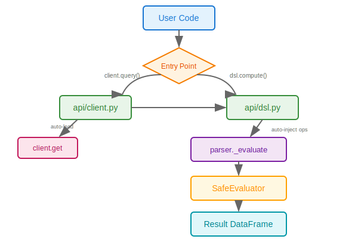

# API Reference

## AlphaLabClient

Main entry point for data access and alpha evaluation.

```python
from alphalab.api.client import AlphaLabClient

client = AlphaLabClient(data_path="/path/to/your/data")
```

### `client.lookup(identifier, as_of=None)`

Resolve a symbol, CIK, or security_id to a `SecurityInfo` object.

```python
info = client.lookup("AAPL")
# SecurityInfo(security_id='14593', symbol='AAPL', company='APPLE INC', ...)

# Point-in-time lookup (e.g., before a ticker change)
info = client.lookup("FB", as_of="2022-01-01")
```

**Parameters:**
- `identifier` (str) — Symbol, CIK, or security_id
- `as_of` (date | str | None) — Point-in-time date for resolving ambiguous symbols

**Returns:** `SecurityInfo | None`

### `client.get(field, symbols=None, universe=None, start=None, end=None)`

Load a pre-built feature wide table.

```python
# All securities, all dates
df = client.get("close")

# Specific symbols and date range
df = client.get("close", symbols=["AAPL", "MSFT"], start="2024-01-01")

# By universe
df = client.get("returns", universe="top3000", start="2024-01-01")
```

**Parameters:**
- `field` (str) — Field name (see [Data Fields](FIELDS.md))
- `symbols` (list[str] | None) — Filter to these symbols (resolved via security master)
- `universe` (str | None) — Load symbols from a named universe (e.g., `"top3000"`)
- `start` (date | str | None) — Start date filter
- `end` (date | str | None) — End date filter

**Returns:** `pl.DataFrame` — Wide table with `Date` column + one column per security

### `client.query(expr, symbols=None, universe=None, start=None, end=None)`

Evaluate an alpha expression with auto-field loading.

Fields referenced in the expression are automatically detected and loaded via `get()`. Supports multi-line expressions with variable assignment and semicolons.

```python
# Single-line
df = client.query("rank(-ts_delta(close, 5))")

# Multi-line with intermediate variables
df = client.query("""
momentum = ts_delta(close, 10) / ts_std(returns, 20);
group_neutralize(rank(momentum), sector)
""")

# With filters
df = client.query("rank(volume)", symbols=["AAPL", "MSFT"], start="2024-01-01")
```

**Parameters:**
- `expr` (str) — Alpha expression (see [Expression Guide](ALPHA-GUIDE.md))
- `symbols`, `universe`, `start`, `end` — Same as `get()`

**Returns:** `pl.DataFrame` — Wide table with computed alpha values

### `client.universe(name="top3000")`

Load a named universe of symbols.

```python
symbols = client.universe("top3000")
# ['AAPL', 'MSFT', 'GOOGL', ...]
```

**Returns:** `list[str]`

## SecurityInfo

Returned by `client.lookup()`.

| Attribute | Type | Description |
|-----------|------|-------------|
| `security_id` | str | Stable identifier across ticker changes |
| `symbol` | str | Current (or as-of) ticker symbol |
| `company` | str | Company name |
| `cik` | str | SEC CIK code |
| `start_date` | date | First active date |
| `end_date` | date | Last active date (or far future if still active) |
| `exchange` | str | Exchange code |
| `sector` | str | GICS sector |
| `industry` | str | GICS industry |
| `subindustry` | str | GICS sub-industry |

## Standalone DSL

For evaluating alpha expressions with custom data (not from AlphaLab storage), use the standalone DSL:

```python
from alphalab.api.dsl import compute

# Single variable
result = compute("rank(-ts_delta(x, 5))", x=my_price_df)

# Multiple variables
result = compute("rank(x - y)", x=close_df, y=vwap_df)

# Multi-line with assignments
result = compute("""
momentum = ts_delta(close, 5)
volatility = ts_std(returns, 20)
rank(momentum / volatility)
""", close=close_df, returns=returns_df)
```

**Parameters:**
- `expr` (str) — Alpha expression (see [Expression Guide](ALPHA-GUIDE.md))
- `**variables` — Variable name to DataFrame mappings

**Returns:** `pl.DataFrame` — Wide table with computed result

### Architecture



**When to use which:**

| Use Case | Function |
|----------|----------|
| AlphaLab data with auto-loading | `client.query()` |
| Custom DataFrames | `dsl.compute()` |
