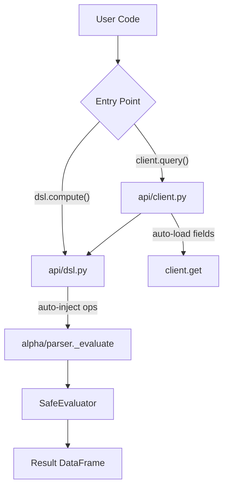

# DSL API Design

**Date:** 2026-02-17
**Status:** Approved

## Goal

Make Alpha DSL user-friendly for standalone use with custom data sources, without requiring `AlphaLabClient`.

## Use Cases

1. **Custom data sources** — Use Alpha DSL with non-AlphaLab data (live feeds, custom CSVs)
2. **Library integration** — Import `alphalab.api.dsl` as a standalone module
3. **Simplified API** — Auto-inject operators, support kwargs for variables

## New Public API

```python
from alphalab.api.dsl import compute

# Single expression
result = compute("rank(-ts_delta(x, 5))", x=close_df)

# Multiple variables
result = compute("rank(x - y)", x=close_df, y=vwap_df)

# Multi-line with assignments
result = compute("""
momentum = ts_delta(close, 5)
rank(-momentum)
""", close=close_df)
```

## Architecture



## Internal Changes

| File | Change |
|------|--------|
| `alpha/parser.py` | Merge `alpha_eval`/`alpha_query` → single `_evaluate(expr, variables, ops)` |
| `alpha/__init__.py` | Remove `alpha_eval` from `__all__` |
| `api/dsl.py` | New file with `compute()` that auto-injects ops |
| `api/client.py` | `query()` calls `dsl.compute()` internally |
| `api/__init__.py` | Export `dsl` module |

## Doc Updates

- `docs/API.md` — Add DSL section with flowchart
- `README.md` — Update examples to show `dsl.compute()`
- `CLAUDE.md` — Update architecture section

## Design Decisions

1. **`compute` not `eval`** — Avoids shadowing Python builtin
2. **kwargs for variables** — `compute("...", x=df1, y=df2)` cleaner than dict
3. **Public API in `api/` only** — `alpha/` module is internal implementation
4. **Auto-inject operators** — No need to pass `ops=` parameter
