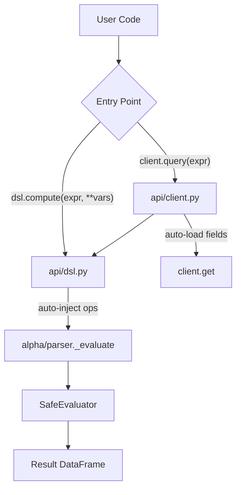

# DSL API Implementation Plan

> **For Claude:** REQUIRED SUB-SKILL: Use superpowers:executing-plans to implement this plan task-by-task.

**Goal:** Create `alphalab.api.dsl.compute()` as user-friendly standalone DSL entry point with auto-injected operators.

**Architecture:** New `api/dsl.py` module wraps internal parser with auto-injected operators. Refactor `alpha/parser.py` to merge `alpha_eval`/`alpha_query` into single `_evaluate()`. Update `client.query()` to use new DSL. Update docs with flowchart.

**Tech Stack:** Python, polars, AST parsing

---

### Task 1: Create api/dsl.py with compute()

**Files:**
- Create: `src/alphalab/api/dsl.py`
- Test: `tests/unit/api/test_dsl.py`

**Step 1: Write the failing test**

Create `tests/unit/api/test_dsl.py`:

```python
"""Tests for alphalab.api.dsl module."""

from datetime import date

import polars as pl
import pytest


class TestDslCompute:
    """Tests for dsl.compute() function."""

    def test_compute_single_variable(self) -> None:
        """Test compute with single variable."""
        from alphalab.api.dsl import compute

        df = pl.DataFrame({
            "Date": [date(2024, 1, 1), date(2024, 1, 2)],
            "A": [1.0, 2.0],
            "B": [3.0, 4.0],
        })
        result = compute("rank(x)", x=df)
        assert result.columns == ["Date", "A", "B"]
        assert len(result) == 2

    def test_compute_multiple_variables(self) -> None:
        """Test compute with multiple variables."""
        from alphalab.api.dsl import compute

        df1 = pl.DataFrame({
            "Date": [date(2024, 1, 1)],
            "A": [10.0],
            "B": [20.0],
        })
        df2 = pl.DataFrame({
            "Date": [date(2024, 1, 1)],
            "A": [1.0],
            "B": [2.0],
        })
        result = compute("x - y", x=df1, y=df2)
        assert result["A"][0] == 9.0
        assert result["B"][0] == 18.0

    def test_compute_multiline_expression(self) -> None:
        """Test compute with multi-line expression and assignments."""
        from alphalab.api.dsl import compute

        df = pl.DataFrame({
            "Date": [date(2024, 1, 1), date(2024, 1, 2), date(2024, 1, 3)],
            "A": [1.0, 2.0, 3.0],
        })
        result = compute("""
        delta = ts_delta(x, 1)
        rank(delta)
        """, x=df)
        assert result.columns == ["Date", "A"]

    def test_compute_no_ops_required(self) -> None:
        """Test that operators work without passing ops parameter."""
        from alphalab.api.dsl import compute

        df = pl.DataFrame({
            "Date": [date(2024, 1, 1), date(2024, 1, 2)],
            "A": [1.0, 2.0],
        })
        # These should work without ops= parameter
        result = compute("ts_mean(x, 2)", x=df)
        assert result is not None

    def test_compute_returns_dataframe(self) -> None:
        """Test that compute returns pl.DataFrame, not Alpha."""
        from alphalab.api.dsl import compute

        df = pl.DataFrame({
            "Date": [date(2024, 1, 1)],
            "A": [1.0],
        })
        result = compute("x + 1", x=df)
        assert isinstance(result, pl.DataFrame)
```

**Step 2: Run test to verify it fails**

Run: `uv run pytest tests/unit/api/test_dsl.py -v`
Expected: FAIL with "No module named 'alphalab.api.dsl'"

**Step 3: Write minimal implementation**

Create `src/alphalab/api/dsl.py`:

```python
"""Standalone DSL for alpha expression evaluation.

Example:
    >>> from alphalab.api.dsl import compute
    >>> result = compute("rank(-ts_delta(x, 5))", x=close_df)
"""

from __future__ import annotations

from typing import TYPE_CHECKING

import polars as pl

import alphalab.api.operators as operators
from alphalab.alpha.parser import _evaluate

if TYPE_CHECKING:
    pass


def compute(expr: str, **variables: pl.DataFrame) -> pl.DataFrame:
    """Evaluate alpha expression with auto-injected operators.

    Args:
        expr: Alpha expression string. Supports:
            - Single expressions: "rank(-ts_delta(x, 5))"
            - Multi-line with assignments: "y = rank(x); y + 1"
        **variables: Variable name to DataFrame mappings

    Returns:
        Wide DataFrame with computed result

    Example:
        >>> # Single variable
        >>> result = compute("rank(-ts_delta(x, 5))", x=close_df)

        >>> # Multiple variables
        >>> result = compute("rank(x - y)", x=close_df, y=vwap_df)

        >>> # Multi-line
        >>> result = compute('''
        ... momentum = ts_delta(close, 5)
        ... rank(-momentum)
        ... ''', close=close_df)
    """
    result = _evaluate(expr, variables, ops=operators)
    return result.data
```

**Step 4: Run test to verify it passes**

Run: `uv run pytest tests/unit/api/test_dsl.py -v`
Expected: FAIL (need to create _evaluate first)

**Step 5: Skip commit until Task 2 complete**

---

### Task 2: Refactor alpha/parser.py - merge alpha_eval/alpha_query

**Files:**
- Modify: `src/alphalab/alpha/parser.py`

**Step 1: Add _evaluate function**

Add to `src/alphalab/alpha/parser.py` before `alpha_eval`:

```python
def _evaluate(
    expr: str,
    variables: dict[str, AlphaLike],
    ops: Any | None = None,
) -> Alpha:
    """Internal: evaluate expression (single or multi-line).

    Automatically detects whether to use eval or exec mode based on
    whether the expression contains assignments or semicolons.

    Args:
        expr: Expression string
        variables: Variable mappings
        ops: Operator module

    Returns:
        Alpha with computed result
    """
    # Use exec mode if expression has assignments or semicolons
    has_assignment = "=" in expr and "==" not in expr.replace("!=", "").replace("<=", "").replace(">=", "")
    has_semicolon = ";" in expr
    mode = "exec" if (has_assignment or has_semicolon) else "eval"

    try:
        tree = ast.parse(expr, mode=mode)
    except SyntaxError as e:
        raise AlphaParseError(f"Invalid expression syntax: {e}") from e

    eval_vars: dict[str, Any] = dict(variables)
    if ops is not None:
        eval_vars["ops"] = ops

    evaluator = SafeEvaluator(eval_vars, ops)
    result = evaluator.visit(tree)

    if isinstance(result, Alpha):
        return result
    if isinstance(result, pl.DataFrame):
        return Alpha(result)
    raise AlphaParseError(f"Expression did not return Alpha/DataFrame: {type(result)}")
```

**Step 2: Run dsl tests**

Run: `uv run pytest tests/unit/api/test_dsl.py -v`
Expected: PASS

**Step 3: Run all parser tests to ensure no regression**

Run: `uv run pytest tests/unit/alpha/test_parser.py -v`
Expected: PASS

**Step 4: Commit**

```bash
git add src/alphalab/api/dsl.py src/alphalab/alpha/parser.py tests/unit/api/test_dsl.py
git commit -m "feat: add dsl.compute() with auto-injected operators"
```

---

### Task 3: Update alpha/__init__.py - remove alpha_eval from public API

**Files:**
- Modify: `src/alphalab/alpha/__init__.py`

**Step 1: Update __init__.py**

Edit `src/alphalab/alpha/__init__.py`:

```python
"""Alpha expression DSL for composing operators.

Note: For user-friendly API, use `alphalab.api.dsl.compute()` instead.
This module contains internal implementation details.
"""

from alphalab.alpha.core import Alpha
from alphalab.alpha.parser import AlphaParseError
from alphalab.alpha.types import AlphaLike, Scalar
from alphalab.alpha.validation import (
    AlphaError,
    ColumnMismatchError,
    DateMismatchError,
)

__all__ = [
    # Core
    "Alpha",
    # Types
    "AlphaLike",
    "Scalar",
    # Exceptions
    "AlphaError",
    "AlphaParseError",
    "ColumnMismatchError",
    "DateMismatchError",
]
```

**Step 2: Run tests**

Run: `uv run pytest tests/unit/alpha/ -v`
Expected: PASS

**Step 3: Commit**

```bash
git add src/alphalab/alpha/__init__.py
git commit -m "refactor: remove alpha_eval from public alpha module"
```

---

### Task 4: Update api/__init__.py - export dsl module

**Files:**
- Modify: `src/alphalab/api/__init__.py`

**Step 1: Update __init__.py**

Edit `src/alphalab/api/__init__.py`:

```python
"""AlphaLab API — data access client and operators for quant research."""

from alphalab.api import dsl
from alphalab.api.client import AlphaLabClient
from alphalab.api.exceptions import (
    ConfigurationError,
    DataNotFoundError,
    AlphaLabError,
    SecurityNotFoundError,
    StorageError,
)
from alphalab.api.types import SecurityInfo

__all__ = [
    "AlphaLabClient",
    "SecurityInfo",
    "AlphaLabError",
    "SecurityNotFoundError",
    "DataNotFoundError",
    "StorageError",
    "ConfigurationError",
    "dsl",
]
```

**Step 2: Test import works**

Run: `python -c "from alphalab.api import dsl; print(dsl.compute)"`
Expected: `<function compute at ...>`

**Step 3: Commit**

```bash
git add src/alphalab/api/__init__.py
git commit -m "feat: export dsl module from alphalab.api"
```

---

### Task 5: Update client.query() to use dsl.compute internally

**Files:**
- Modify: `src/alphalab/api/client.py`

**Step 1: Update query method**

In `src/alphalab/api/client.py`, replace the query method implementation:

```python
def query(
    self,
    expr: str,
    symbols: Sequence[str] | None = None,
    universe: str | None = None,
    start: date | str | None = None,
    end: date | str | None = None,
) -> pl.DataFrame:
    """Evaluate multi-line alpha expression with auto-field loading.

    Fields referenced in the expression are automatically loaded via get().
    Supports variable assignment and semicolons for multi-statement expressions.

    Args:
        expr: Alpha expression (e.g., "rank(-ts_delta(close, 5))")
        symbols: Symbol(s) to include
        universe: Universe name to resolve symbols from
        start: Start date filter
        end: End date filter

    Returns:
        Wide DataFrame with Date + symbol columns
    """
    from alphalab.api.dsl import compute

    if isinstance(start, str):
        start = date.fromisoformat(start)
    if isinstance(end, str):
        end = date.fromisoformat(end)

    start = start or date(2000, 1, 1)
    end = end or date.today() - timedelta(days=1)

    # Auto-detect field references
    fields = self._extract_field_refs(expr)

    # Load each field
    variables: dict[str, pl.DataFrame] = {}
    for f in fields:
        variables[f] = self.get(f, symbols=symbols, universe=universe, start=start, end=end)

    return compute(expr, **variables)
```

**Step 2: Remove old import**

Remove this line from client.py if it exists:
```python
from alphalab.alpha.parser import alpha_query
```

**Step 3: Run client tests**

Run: `uv run pytest tests/unit/api/test_client.py -v`
Expected: PASS

**Step 4: Commit**

```bash
git add src/alphalab/api/client.py
git commit -m "refactor: client.query() uses dsl.compute() internally"
```

---

### Task 6: Update docs/API.md with DSL section and flowchart

**Files:**
- Modify: `docs/API.md`

**Step 1: Add DSL section after SecurityInfo**

Append to `docs/API.md`:

```markdown

## Standalone DSL

For evaluating alpha expressions with custom data (not from AlphaLab storage), use the standalone DSL:

```python
from alphalab.api.dsl import compute

# Single variable
result = compute("rank(-ts_delta(x, 5))", x=my_price_df)

# Multiple variables
result = compute("rank(x - y)", x=close_df, y=vwap_df)

# Multi-line with assignments
result = compute("""
momentum = ts_delta(close, 5)
volatility = ts_std(returns, 20)
rank(momentum / volatility)
""", close=close_df, returns=returns_df)
```

**Parameters:**
- `expr` (str) — Alpha expression (see [Expression Guide](ALPHA-GUIDE.md))
- `**variables` — Variable name to DataFrame mappings

**Returns:** `pl.DataFrame` — Wide table with computed result

### Architecture



**When to use which:**

| Use Case | Function |
|----------|----------|
| AlphaLab data with auto-loading | `client.query()` |
| Custom DataFrames | `dsl.compute()` |
```

**Step 2: Commit**

```bash
git add docs/API.md
git commit -m "docs: add standalone DSL section with architecture flowchart"
```

---

### Task 7: Update README.md

**Files:**
- Modify: `README.md`

**Step 1: Add DSL example to Features section**

After the existing features list, update the Research section example:

Find and update the Research section to include DSL:

```markdown
### Research

```python
from alphalab.api import AlphaLabClient, dsl

client = AlphaLabClient(data_path="/path/to/your/data")

# Look up any symbol (resolves across ticker changes)
client.lookup("AAPL")

# Load pre-built feature tables
client.get("close", symbols=["AAPL", "MSFT"], start="2024-01-01")

# Alpha expressions — same syntax as WorldQuant BRAIN
client.query("rank(-ts_delta(close, 5))")

# Standalone DSL for custom data
result = dsl.compute("rank(x - y)", x=my_close_df, y=my_vwap_df)
```
```

**Step 2: Commit**

```bash
git add README.md
git commit -m "docs: add dsl.compute() example to README"
```

---

### Task 8: Update CLAUDE.md

**Files:**
- Modify: `CLAUDE.md`

**Step 1: Update architecture section**

Find the "Core Components" section and update item 6 and add item for API:

```markdown
**6. Alpha DSL** (`src/alphalab/alpha/`)
- `core.py`: `Alpha` class with operator overloading
- `parser.py`: AST-based expression parser, `SafeEvaluator`, internal `_evaluate()`
- `types.py`: Type definitions (`AlphaLike`, `Scalar`)
- Internal module — use `alphalab.api.dsl` for public interface

**7. Public API** (`src/alphalab/api/`)
- `client.py`: `AlphaLabClient` — data access with auto-field loading
- `dsl.py`: `compute()` — standalone DSL for custom DataFrames
- `operators/`: 68 operators (time-series, cross-sectional, group, etc.)
```

**Step 2: Commit**

```bash
git add CLAUDE.md
git commit -m "docs: update CLAUDE.md with DSL architecture"
```

---

### Task 9: Final verification and push

**Step 1: Run full test suite**

Run: `uv run pytest --cov=src/alphalab -m unit`
Expected: All tests pass, coverage maintained

**Step 2: Push all commits**

```bash
git push
```

**Step 3: Verify CI passes**

Check GitHub Actions for green build.
